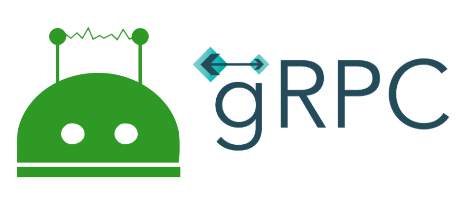

<div align="center">

<br />
<h1>Wechaty gRPC</h1>
<p>
gRPC Service & Protocol Buffers for Wechaty Puppet
</p>
<a href="https://github.com/wechaty/grpc/issues
"></a>
<a href="https://github.com/wechaty/grpc/network/members"></a>
<a href="https://github.com/wechaty/grpc/stargazers"></a>
<a href="https://github.com/wechaty/grpc/blob/master/LICENSE"></a>
</div>

<div align="center">

[](https://github.com/Chatie/grpc/actions?query=workflow%3ANode.js) [](https://github.com/Chatie/grpc/actions?query=workflow%3ANPM) [](https://github.com/Chatie/grpc/actions?query=workflow%3APyPI) [](https://github.com/Chatie/grpc/actions?query=workflow%3A%22Maven%22) [](https://github.com/Chatie/grpc/actions?query=workflow%3APHP) [](https://github.com/chatie/grpc/actions?query=workflow%3AGo)

[](https://www.npmjs.com/package/wechaty-grpc) [](https://pypi.org/project/chatie-grpc/) [](https://mvnrepository.com/artifact/io.github.wechaty/grpc) [](https://packagist.org/packages/wechaty/php-grpc) [](https://nodejs.org/) [](https://www.python.org/downloads/release/python-370/) [](https://pkg.go.dev/github.com/chatie/grpc/go/wechaty)

</div>

<details open="open">
<summary>Table of Contents</summary>
<ol>
<li>
<a href="#About">About</a>
</li>
<li>
<a href="#Usage">Usage</a>
<ul>
<li><a href="#Nodejs">Node.js</a></li>
<li><a href="#Python">Python</a></li>
<li><a href="#Go">Go</a></li>
<li><a href="#Java">Java</a></li>
<li><a href="#PHP">PHP</a></li>
<li><a href="#CSharp">CSharp</a></li>
</ul>
</li>
<li>
<a href="#Development">Development</a>
<ul>
<li><a href="#Debug">Debug</a></li>
<li><a href="#Build">Build</a></li>
<li><a href="#Generate-Stubs">Generate Stubs</a></li>
</ul>
</li>
<li><a href="#OpenAPI">OpenAPI</a></li>
<li><a href="#gRPC-Web">gRPC Web</a></li>
<li><a href="#Resources">Resources</a></li>
<li><a href="#Contributing">Contributing</a></li>
<li><a href="#Maintainer">Maintainer</a></li>
<li><a href="#Copyright--License">Copyright & License</a></li>
</ol>

## About

gRPC is a modern open-source high-performance Remote Procedure Call (RPC) framework that can run in any environment. It can efficiently connect services in and across data centers with pluggable support for load balancing, tracing, health checking, and authentication. It is also applicable in the last mile of distributed computing to connect devices, mobile applications, and browsers to backend services.

## Usage

#### Node.js

[wechaty-grpc@NPM](https://www.npmjs.com/package/wechaty-grpc)

**Maintainer:**

- [@huan](https://github.com/huan) - Huan LI (李卓桓)

#### Python

[chatie-grpc@PyPI](https://pypi.org/project/chatie-grpc)

**Maintainer:**

- [@wj-Mcat](https://github.com/wj-Mcat) - Jingjing WU (吴京京)

#### Go

[github.com/wechaty/go-grpc](https://github.com/wechaty/go-grpc)

**Maintainer:**

- [@dchaofei](https://github.com/dchaofei) - Chaofei DING (丁超飞)

#### Java

[https://mvnrepository.com/artifact/io.github.wechaty/grpc](https://mvnrepository.com/artifact/io.github.wechaty/grpc)

**Maven:**

```xml
<dependency>
    <groupId>io.github.wechaty</groupId>
    <version>0.11.25</version>
    <artifactId>grpc</artifactId>
</dependency>
```

**Gradle:**

```groovy
compile 'io.github.wechaty:grpc:0.11.25'
```

**Maintainer:**

- [@diaozxin007](https://github.com/diaozxin007) - Zhengxin DIAO (刁政欣)

### PHP

[github.com/wechaty/php-grpc](https://github.comwechaty/php-grpc)

**Maintainer:**

- [@zhangchunsheng](https://github.com/zhangchunsheng) - Chunsheng ZHANG (张春生)

### CSharp

[Wechaty.Grpc @ Nuget](https://www.nuget.org/packages/Wechaty.Grpc)

**Maintainer:**

- [@Darren](https://github.com/jesn) - Darren (郑波)

## Development

### Debug

- [GUI Client for GRPC Services](https://github.com/uw-labs/bloomrpc) - BloomRPC aims to give the simplest and efficient developer experience for exploring and querying your GRPC services. (Inspired by Postman and GraphQL Playground)
- [A gRPC CLI interface for easy testing against gRPC servers with Node.js REPL](https://github.com/njpatel/grpcc)

```shell
grpcc --proto ./service/myservice.proto --address 127.0.0.1:3466
```

### Build

```shell
./scripts/install-protoc.sh
npm install
```

> <https://github.com/google/protobuf/releases/latest>

### Generate Stubs

```shell
npm run generate
```

#### 1. JS for Protocol Buffer

```shell
protoc \
  --js_out="import_style=commonjs,binary:${OUT_DIR}"
```

> <https://github.com/google/protobuf/releases/latest>

#### 2. JS for gRPC Stubs

```shell
protoc \
  --plugin="protoc-gen-grpc=`which grpc_tools_node_protoc_plugin`" \
  --grpc_out="${OUT_DIR}"
```

> <https://www.npmjs.com/package/grpc-tools>

#### 3. TypeScript Typing Definations for Protocol Buffer & gRPC Stubs

```shell
protoc \
  --plugin="protoc-gen-grpc=node_modules/grpc_tools_node_protoc_ts/bin/protoc-gen-ts" \
  --grpc_out="${OUT_DIR}"
```

> <https://github.com/agreatfool/grpc_tools_node_protoc_ts>

#### 4. JS & TS for gRPC Web

```shell
protoc \
  --plugin="protoc-gen-ts=node_modules/ts-protoc-gen/bin/protoc-gen-ts" \
  --ts_out="service=true:${OUT_DIR}"
```

> <https://github.com/improbable-eng/ts-protoc-gen>

## OpenAPI

Thanks to the ecosystem of gRPC, we can generate OpenAPI Specification from our gRPC proto definitions automatically.

We are using [gRPC to JSON proxy generator following the gRPC HTTP spec](https://github.com/grpc-ecosystem/grpc-gateway) as the OpenAPI Specification generator ([protoc-gen-openapiv2](https://github.com/grpc-ecosystem/grpc-gateway/tree/master/protoc-gen-openapiv2)), and using [Like grpc-gateway, but written in node and dynamic](https://github.com/konsumer/grpc-dynamic-gateway) project to serve an HTTP RESTful API to gRPC proxy.

<div align="center"><a link="https://github.com/wechaty/openapi"><a></div>

> Image credit: [gRPC Gateway](https://grpc-ecosystem.github.io/grpc-gateway/)

Learn more about the RESTful API service for Wechaty from [Wechaty OpenAPI](https://github.com/wechaty/openapi).

See also: [AIP-4222 - Routing headers](https://google.aip.dev/client-libraries/4222)

## gRPC Web

- [gRPC-Web ReactJS client, Golang Server](https://github.com/longfellowone/grpcwebtest)

## Resources

Check out [RESOURCES.md](RESOURCES.md) file for learning resources.

## Contributing

Contributions are what make the open-source community such an amazing place to learn, inspire, and create. Any contributions you make are **greatly appreciated**.

1. Fork the Project
2. Create your Feature Branch (`git checkout -b feature/AmazingFeature`)
3. Commit your Changes (`git commit -m 'Add some AmazingFeature'`)
4. Push to the Branch (`git push origin feature/AmazingFeature`)
5. Open a Pull Request

See [CONTRIBUTING.md](http://github.com/wechaty/grpc/blob/master/CONTRIBUTING.md) for more details.

## Releases

Since its creation in 2016, a number of Wechaty versions have been released. For more information about the release history and the current stable version, you can read the [Wechaty release notes](https://github.com/Wechaty/wechaty/releases) on Github.

## Maintainer

Wechaty is maintained by [Huan](https://github.com/huan), [Rui](https://github.com/lijiarui), and a community of Open Source Contributors. We are always looking for people to join the Wechaty community to maintain the Wechaty codebase and documentation. You necessarily don't have to be a programmer to contribute to Wechaty. To get started contributing, you can read the [CONTRIBUTING.md](http://github.com/wechaty/grpc/blob/master/CONTRIBUTING.md).

## Getting help

Wechaty has a community of very helpful contributors on different platforms you can join to get help from. Before joining any of the communities, we recommend that you read our Code of conduct]o that you adhere to our community guidelines. A full list of the different Wechaty communities can be accessed from the [Wechaty community](https://wechaty.js.org/docs/community/) section of this documentation.

## Copyright & License

Wechaty is an [Open Source Project](https://opensource.com/resources/what-open-source). It is released under [Apache-2.0 license](https://github.com/wechaty/wechaty/blob/master/LICENSE) and the corresponding documentation is released under the [Creative Commons license](https://creativecommons.org/licenses/).
